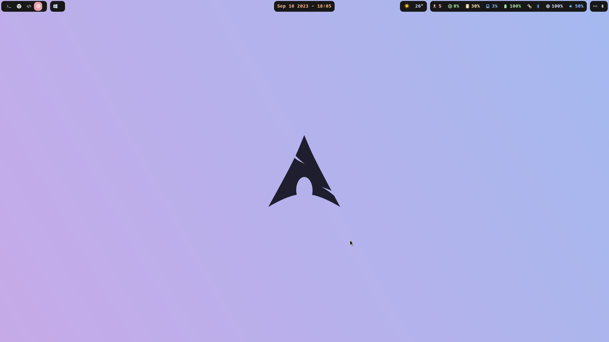
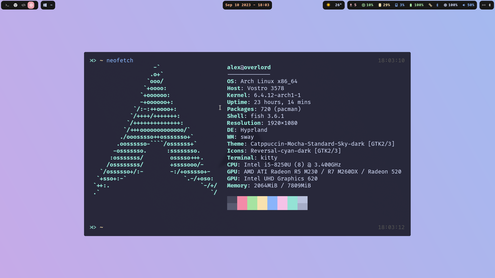

<div align="center">

# Hyprland Config

##### My dotfiles for Hyprland and Waybar




</div>

## Installation

* [hyprland](https://github.com/hyprwm/Hyprland)
* [waybar](https://github.com/Alexays/Waybar)

There are also some other packages like rofi, dunst, python, etc. that are
used, but will add a full list soon.

```console
./install.sh
```
