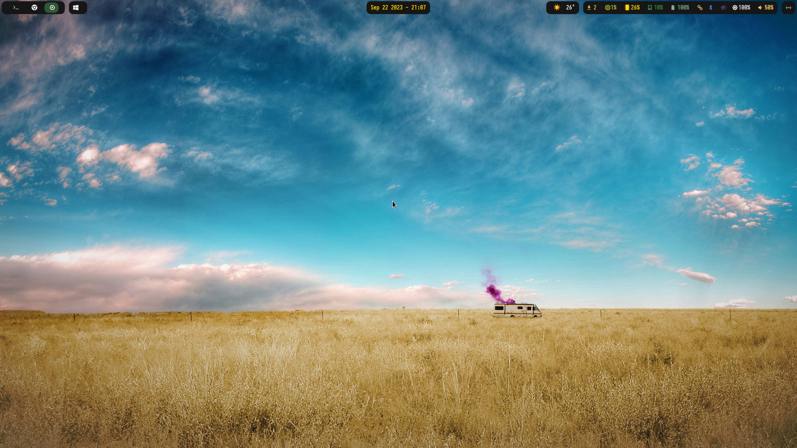
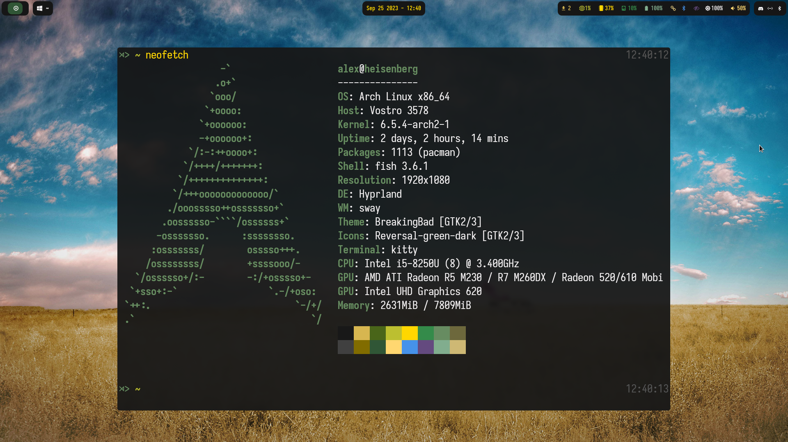

<div align="center">

# Hyprland Config

##### My dotfiles for Hyprland and Waybar




</div>

## Installation

* [hyprland](https://github.com/hyprwm/Hyprland)
* [waybar](https://github.com/Alexays/Waybar)
* [dunst](https://github.com/dunst-project/dunst)
* [rofi](https://github.com/davatorium/rofi)
* [swaylock](https://github.com/swaywm/swaylock)
* [wlogout](https://github.com/ArtsyMacaw/wlogout)
* [kitty](https://github.com/kovidgoyal/kitty)

There are also some other packages like rofi, dunst, python, etc. that are
used, but will add a full list soon.

```console
./install.sh
```
